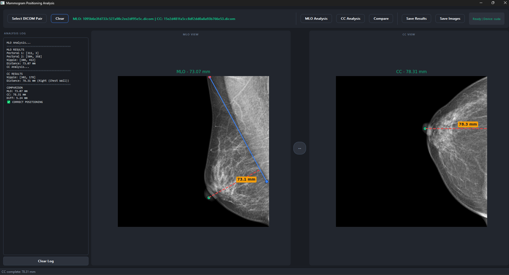

# Deep Mammography Positioning Quality Assessment

A comprehensive deep learning framework for automated mammography positioning quality evaluation using landmark detection and rule-based assessment.

## Project Overview

This project implements two complementary approaches for mammography quality assessment:

1. **Rule-Based Landmark Assessment**: Detects anatomical landmarks (pectoral muscle line, nipple) using CRAUNet and applies clinical quality rules (10mm PNL rule)
2. **Dual-Stream Classification**: Direct quality prediction using paired MLO-CC images without explicit landmark detection

## Key Features

- **Centralized Data Structure**: Single `data/` directory for all raw and processed images
- **Portable Configuration**: All paths are relative - works immediately after cloning
- **Automatic Model Detection**: Evaluation pipeline automatically finds trained models
- **Clinical Rule-Based**: Implements 10mm positioning quality rule
- **Dual Approach**: Compare rule-based vs end-to-end learning methods

## Project Structure

```
deep-mammography-positioning/
│
├── data/                                    # CENTRALIZED DATA STORAGE
│   ├── raw/
│   │   ├── mlo/                            # Raw MLO DICOM files (.dicom)
│   │   └── cc/                             # Raw CC DICOM files (.dicom)
│   └── processed/
│       ├── mlo/
│       │   ├── images/                     # Preprocessed MLO images (.npy, 512x512)
│       │   └── transformation_details.csv
│       └── cc/
│           ├── images/                     # Preprocessed CC images (.npy, 512x512)
│           └── transformation_details.csv
│
├── labels/                                  # Train/Val/Test split labels
│   ├── mlo_labels.csv
│   ├── cc_labels.csv
│   └── metadata.csv
│
├── rule-based-model/                        # Landmark detection + Clinical rules
│   ├── mlo-landmark-detection/             # MLO landmark detection training
│   │   ├── code/regression/
│   │   │   ├── preprocessing/              # MLO preprocessing scripts
│   │   │   └── main/                       # Training code
│   │   ├── models/                         # Trained MLO model (.pth)
│   │   └── landmark_coords/                # Landmark JSON files
│   │
│   ├── cc-landmark-detection/              # CC landmark detection training
│   │   ├── code/regression/
│   │   │   ├── preprocessing/              # CC preprocessing scripts
│   │   │   └── main/                       # Training code
│   │   ├── models/                         # Trained CC model (.pth)
│   │   └── landmark_coords/                # Landmark JSON files
│   │
│   └── test-models/                        # Unified evaluation pipeline
│
└── dual-stream-classification/             # End-to-end classification approach
    ├── main.py
    ├── model_configs.py
    └── utils/
```

## Quick Start

### Prerequisites

```bash
git clone https://github.com/enescanerkan/deep-mammography-positioning.git
cd deep-mammography-positioning
pip install -r requirements.txt
```

### Step 1: Prepare Raw Data

Place your DICOM files in the centralized data directory:
```
data/raw/mlo/   →  MLO DICOM files (e.g., abc123.dicom)
data/raw/cc/    →  CC DICOM files (e.g., abc123.dicom)
```

### Step 2: Generate Landmarks (One-time)

```bash
# MLO landmarks (pectoral line + nipple)
cd rule-based-model/mlo-landmark-detection/code/regression/preprocessing
python generate_landmarks.py

# CC landmarks (nipple only)
cd ../../../../../../cc-landmark-detection/code/regression/preprocessing
python generate_cc_landmarks.py
```

### Step 3: Preprocess Images

```bash
# MLO preprocessing
cd rule-based-model/mlo-landmark-detection/code/regression/preprocessing
python crop_pad_resize_dataset.py

# CC preprocessing  
cd ../../../../../../cc-landmark-detection/code/regression/preprocessing
python crop_pad_resize_cc_dataset.py
```

**Output**: Preprocessed images in `data/processed/mlo/images/` and `data/processed/cc/images/`

### Step 4: Train MLO Landmark Detection Model

```bash
cd rule-based-model/mlo-landmark-detection/code/regression/main
python main.py --config configs/example_config.json
```

**Output**: `rule-based-model/mlo-landmark-detection/models/mlo_model.pth`

### Step 5: Train CC Landmark Detection Model

```bash
cd rule-based-model/cc-landmark-detection/code/regression/main
python main.py --config configs/cc_training_config.json
```

**Output**: `rule-based-model/cc-landmark-detection/models/cc_model.pth`

### Step 6: Train Dual-Stream Classification (Optional)

```bash
cd dual-stream-classification
python main.py --model resnet18
```

**Note**: Uses the same preprocessed data from `data/processed/`

## Models

### 1. MLO Landmark Detection (CRAUNet)

| Property | Value |
|----------|-------|
| Input | MLO mammography image (512x512) |
| Output | 6 coordinates (pec1_x, pec1_y, pec2_x, pec2_y, nipple_x, nipple_y) |
| Training Data | Good quality MLO images only |
| Architecture | Coordinate-aware Residual Attention UNet |

### 2. CC Landmark Detection (CRAUNet)

| Property | Value |
|----------|-------|
| Input | CC mammography image (512x512) |
| Output | 2 coordinates (nipple_x, nipple_y) |
| Training Data | All quality levels (Good + Bad) |
| Architecture | Same as MLO, different output dimension |

### 3. Dual-Stream Classification

| Property | Value |
|----------|-------|
| Input | Paired MLO-CC images |
| Output | Binary quality prediction (Good/Bad) |
| Architecture | ResNet-18/50, EfficientNet-B0, MobileNet-V2 |

## Training Parameters

### MLO Landmark Detection

| Parameter | Value |
|-----------|-------|
| Architecture | CRAUNet |
| Optimizer | Adam (LR=1e-4) |
| Scheduler | Cosine + Warmup (5 epochs) |
| Loss | Wing Loss (α=1.8, β=1.8, γ=0.6) |
| Epochs | 300 (Early stopping patience=40) |

### CC Landmark Detection

| Parameter | Value |
|-----------|-------|
| Architecture | CRAUNet |
| Optimizer | Adam (LR=1e-4) |
| Scheduler | Cosine + Warmup (5 epochs) |
| Loss | Wing Loss (α=1.0, β=1.0, γ=1.0) |
| Epochs | 300 (Early stopping patience=40) |

### Dual-Stream Classification

| Parameter | Value |
|-----------|-------|
| Architecture | Dual ResNet-18 |
| Optimizer | Adam (LR=3e-5) |
| Scheduler | ReduceLROnPlateau |
| Loss | Weighted CrossEntropy |
| Epochs | 50 (Early stopping patience=15) |

## Clinical Quality Rules

### 10mm Posterior Nipple Line (PNL) Rule

```
PNL_MLO = Distance from nipple to pectoral line in MLO view
PNL_CC = Distance from nipple to chest wall in CC view

Quality = Good  if  |PNL_MLO - PNL_CC| < 10mm
Quality = Bad   if  |PNL_MLO - PNL_CC| ≥ 10mm
```

## Dataset Structure

### Labels CSV Format

```csv
SOPInstanceUID,StudyInstanceUID,SeriesDescription,qualitativeLabel,Split,labelName,data
abc123,study001,L-MLO,Good,Train,Pectoralis,{"vertices":[[x1,y1],[x2,y2]]}
abc123,study001,L-MLO,Good,Train,Nipple,{"x":100,"y":200,"width":50,"height":50}
```

**Important**: MLO and CC pairs share the same `StudyInstanceUID` and side (L/R).

## File Extensions

- **Raw DICOM**: `.dicom` (preferred) or `.dcm` (legacy support)
- **Preprocessed**: `.npy` (NumPy arrays, 512x512, normalized)

## Portability

All configurations use **relative paths** that work automatically:

```json
{
    "_comment": "All paths are relative - no manual editing needed",
    "split_file": "../../../../../../../labels/mlo_labels.csv",
    "base_image_dir": "../../../../../../../data/processed/mlo/images"
}
```

## Desktop Application

A standalone Windows application is available with pre-trained models for immediate use.

**Download**: [MammogramAnalysis.exe](https://drive.google.com/file/d/1NjDYhdxcQtbDw1QGIOfMldMnwW8qhSY3/view?usp=drive_link)

### Features
- Load MLO and CC DICOM pairs directly
- Automatic landmark detection and quality assessment
- Visual display of pectoral muscle line, nipple position, and PNL measurements
- Side-by-side MLO/CC comparison view
- Export results and annotated images

### Screenshot



*The application displays MLO view (left) with pectoral muscle line and nipple-to-pectoral distance, CC view (right) with nipple-to-chest wall distance, and automated quality assessment based on the 10mm PNL rule.*

## License

MIT License
